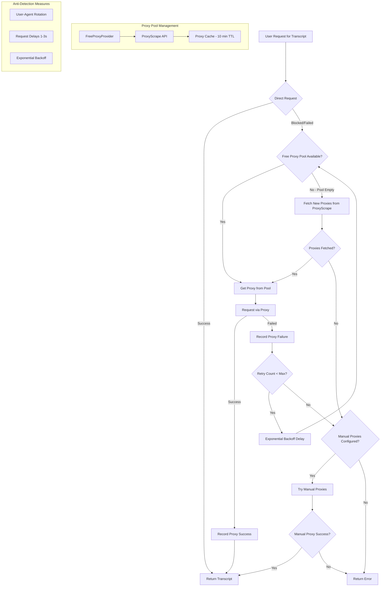

# YouTube Transcript Proxy Rotation Enhancement Plan

## Problem Statement
The current backend YouTube transcript fetching is being blocked by Google because:
- Multiple users share a single IP address
- Concurrent requests from the same IP trigger spam detection
- No IP rotation or anti-detection measures implemented

## Research Findings

### ❌ Client-Side Fetching (NOT FEASIBLE)
- CORS blocks browser requests to YouTube servers
- YouTube doesn't set `Access-Control-Allow-Origin` headers
- All JavaScript libraries for YouTube transcripts work only on Node.js/server-side

### ❌ YouTube Data API v3 (NOT SUITABLE)
- **Captions endpoint requires OAuth from video OWNER**
- You can only download captions for videos you own
- Not suitable for fetching transcripts from arbitrary videos
- Free tier: 10,000 units/day (captions.list costs 50 units = ~200 operations)

### ✅ Free Proxy Rotation (RECOMMENDED)
Best free option: **ProxyScrape API**
- API: `https://api.proxyscrape.com/v2/`
- Returns HTTP, SOCKS4, SOCKS5 proxies
- Filters: country, anonymity level, timeout
- Updated every 5 minutes
- Completely FREE with no registration required

## Solution Architecture



## Implementation Details

### 1. New Settings in config/settings.py
```python
USE_FREE_PROXIES: bool = True
FREE_PROXY_REFRESH_INTERVAL: int = 600  # 10 minutes
FREE_PROXY_MIN_POOL_SIZE: int = 10
FREE_PROXY_TIMEOUT: int = 5000  # ms
FREE_PROXY_ANONYMITY: str = "elite,anonymous"
REQUEST_DELAY_MIN: float = 1.0  # seconds
REQUEST_DELAY_MAX: float = 3.0  # seconds
```

### 2. FreeProxyProvider Class
- Fetches proxies from ProxyScrape API
- Caches proxies for configurable duration
- Filters by anonymity level and timeout
- Automatically refreshes when pool is depleted

### 3. Enhanced ProxyManager
- Integrates with FreeProxyProvider
- Quality scoring based on success/failure rates
- Removes bad proxies from rotation
- Falls back to manual proxies as last resort

### 4. Anti-Detection Measures
- **User-Agent Rotation**: Pool of 10+ browser user agents
- **Request Delays**: Random 1-3 second delays between requests
- **Exponential Backoff**: 2^attempt seconds delay on failures
- **Proxy Cooling**: Temporarily ban failing proxies

## Free Proxy Sources

| Source | API Endpoint | Update Frequency | Cost |
|--------|--------------|------------------|------|
| ProxyScrape | api.proxyscrape.com/v2 | Every 5 min | FREE |
| Backup: Free-Proxy-List | (Fallback only) | Varies | FREE |

## Fallback Chain
1. **Direct Request** (no proxy) - fastest, try first
2. **Free Proxies** (from ProxyScrape) - dynamic pool
3. **Manual Proxies** (from YOUTUBE_PROXIES env var) - if configured
4. **Error** - all options exhausted

## Files to Modify
1. `requirements.txt` - Add `proxyscrape` package
2. `config/settings.py` - Add new proxy settings
3. `services/youtube_service.py` - Main implementation

## Expected Benefits
- **No cost** - uses free proxy services
- **Better reliability** - large pool of rotating IPs
- **Automatic recovery** - dead proxies are replaced
- **Reduced blocking** - multiple IPs distribute load
- **Anti-detection** - user-agent rotation and delays
