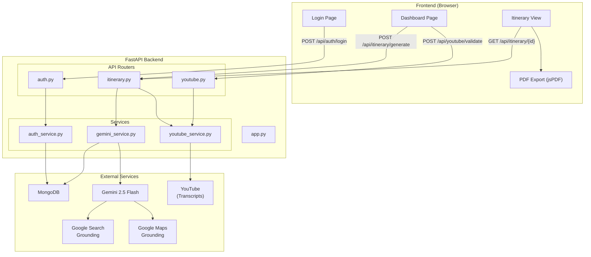
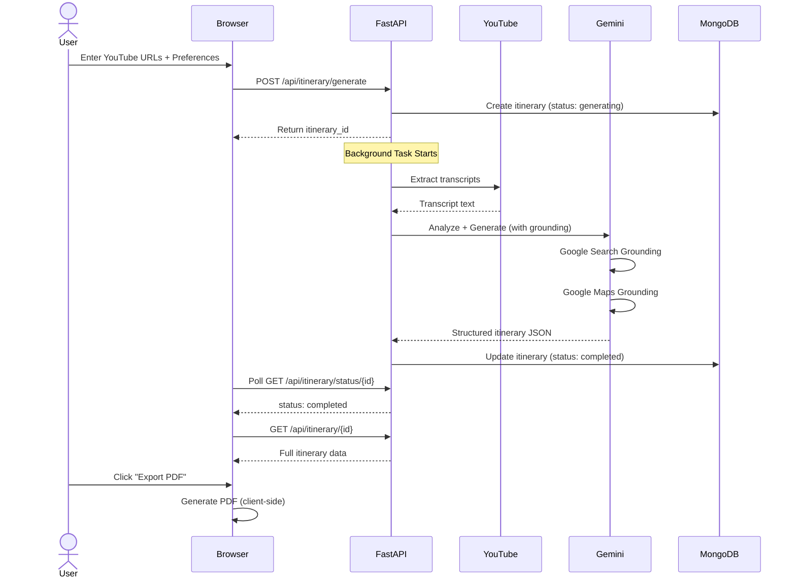
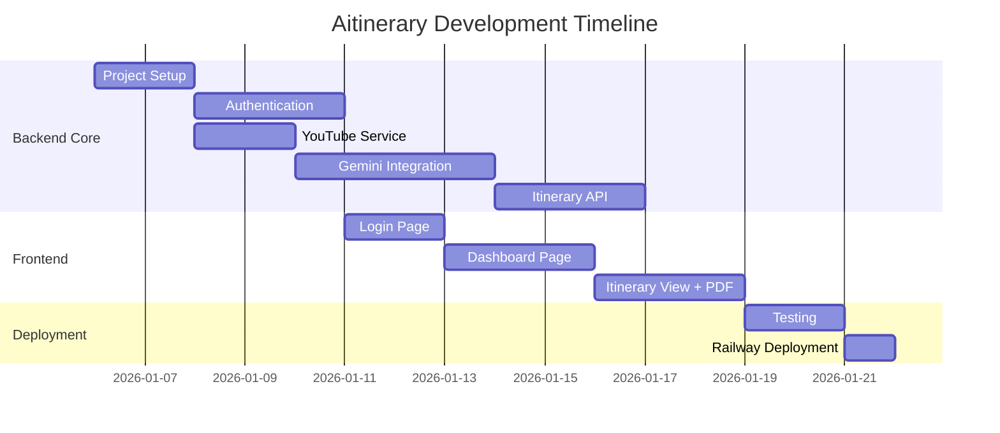

# Aitinerary - Project Overview

## Project Summary

**Aitinerary** is an AI-powered travel itinerary generator that creates personalized travel plans by analyzing YouTube travel vlogs. Users provide YouTube video URLs and their travel preferences, and the system uses Gemini 2.5 Flash with Google Search and Google Maps grounding to generate comprehensive, day-by-day itineraries with real-time pricing, local recommendations, and scam warnings.

---

## Architecture Diagram



---

## Data Flow



---

## Implementation Sequence

| Step | Name | Dependencies | Effort |
|------|------|--------------|--------|
| 1 | [Project Setup](./02_step_01_project_setup.md) | None | 1-2 days |
| 2 | [Authentication](./03_step_02_authentication.md) | Step 1 | 2-3 days |
| 3 | [YouTube Service](./04_step_03_youtube_service.md) | Step 1 | 1-2 days |
| 4 | [Gemini Integration](./05_step_04_gemini_service.md) | Steps 1, 3 | 3-4 days |
| 5 | [Itinerary API](./06_step_05_itinerary_api.md) | Steps 1-4 | 2-3 days |
| 6 | [Login Page](./07_step_06_login_page.md) | Steps 1, 2 | 1-2 days |
| 7 | [Dashboard Page](./08_step_07_dashboard_page.md) | Steps 5, 6 | 2-3 days |
| 8 | [Itinerary View](./09_step_08_itinerary_view.md) | Steps 5, 7 | 2-3 days |
| 9 | [Testing & Deploy](./10_step_09_testing_deployment.md) | All | 2-3 days |

---

## Timeline Estimate



**Total Estimated Time: 16-21 working days (~3-4 weeks)**

---

## File Structure

```
Aitinerary/
├── app.py                              # Main FastAPI application
├── requirements.txt                    # Python dependencies
├── .env.example                        # Environment template
├── .gitignore
├── Procfile                            # Railway deployment
│
├── api/
│   ├── __init__.py
│   ├── dependencies.py                 # Auth dependencies
│   └── routers/
│       ├── __init__.py
│       ├── auth.py                     # Auth endpoints
│       ├── itinerary.py                # Itinerary CRUD
│       └── youtube.py                  # YouTube validation
│
├── config/
│   ├── __init__.py
│   ├── settings.py                     # Pydantic settings
│   └── database.py                     # MongoDB connection
│
├── models/
│   ├── __init__.py
│   ├── user.py                         # User schemas
│   ├── itinerary.py                    # Itinerary schemas
│   └── preferences.py                  # Preference schemas
│
├── services/
│   ├── __init__.py
│   ├── auth_service.py                 # Password + JWT
│   ├── youtube_service.py              # Transcript extraction
│   └── gemini_service.py               # AI generation
│
├── page_serving_routers/
│   ├── __init__.py
│   ├── pages_router.py                 # Page routes
│   ├── pages/
│   │   ├── login.html
│   │   ├── dashboard.html
│   │   └── itinerary.html
│   ├── css/
│   │   ├── common.css                  # Shared styles
│   │   ├── login.css
│   │   ├── dashboard.css
│   │   └── itinerary.css
│   ├── js/
│   │   ├── auth.js                     # Auth utilities
│   │   ├── login.js
│   │   ├── dashboard.js
│   │   └── itinerary.js
│   └── images/
│       └── logo.svg
│
├── tests/
│   ├── __init__.py
│   ├── conftest.py
│   ├── test_auth.py
│   ├── test_youtube_service.py
│   ├── test_gemini_service.py
│   └── test_itinerary_api.py
│
└── project_implementation_plan/        # This folder
    ├── 00_overview.md
    ├── 00_requirements.md
    ├── 01_tech_stack.md
    └── 02-10_step_*.md
```

---

## Key Technologies

| Component | Technology | Purpose |
|-----------|------------|---------|
| Backend | FastAPI + Python 3.11 | Async API framework |
| Database | MongoDB (Motor) | Document storage |
| AI | Gemini 2.5 Flash | Itinerary generation |
| Grounding | Google Search + Maps | Real-time data |
| Transcripts | youtube-transcript-api | Video analysis |
| Auth | JWT + bcrypt | Session management |
| Frontend | Vanilla HTML/CSS/JS | No build step |
| PDF | jsPDF + html2pdf.js | Client-side export |
| Deployment | Railway | Hosting |

---

## Verification Plan

### Automated Tests
```bash
# Run all tests
pytest tests/ -v

# Run with coverage
pytest tests/ --cov=. --cov-report=html
```

### Manual Verification
1. **Auth Flow**: Register → Login → Auto-redirect → Logout
2. **Generation Flow**: Add URLs → Fill preferences → Generate → View
3. **PDF Export**: View itinerary → Export → Verify PDF content
4. **Error Handling**: Invalid URL → See error message

### Production Verification
1. Deploy to Railway
2. Test with real YouTube videos
3. Verify PDF generation works in production
4. Check MongoDB data persistence

---

## Next Steps

1. **Review this plan** and provide feedback
2. Set up Gemini API key at [Google AI Studio](https://aistudio.google.com/)
3. Decide on MongoDB hosting (Railway plugin vs Atlas)
4. Begin implementation with Step 1: Project Setup
